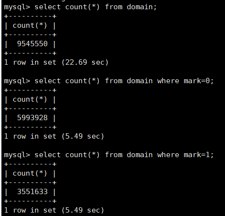

##前言
渗透测试第一步是收集信息，找到和漏洞匹配的目标肯定美滋滋,那我们就先采集大量的域名然后再筛选。于是就有了这个项目。

先看下目前成果。



一个月的采集结果,只要服务器配置高一点,三个月至少能采集过亿的域名。


##项目原理

利用python3异步asyncio+aiohttp 高并发采集网站内页链接+外链

内链采集写入link表中间,没有采集过的内链 mark=0,采集过的内链标识 mark=1。外链写入domain表中,没有采集过的mark=0,采集过的mark=1。

采集外链
```python
            if 'http' in tag_a["href"] and domain not in tag_a["href"] and "." in tag_a["href"] :
                out_change = parse.urlparse(tag_a["href"])
                sql = """INSERT INTO domain(url,mark)
                         VALUES (%s,%s)"""

                try:
                    #cursor.execute(sql,(domain,1))
                    cursor.execute(sql,(out_change.netloc,0))
                    db.commit()
                except:

                    db.rollback()
```

采集内链
```python
            if "//" not in tag_a["href"] and 'http'!=tag_a["href"][0:3] and len(tag_a["href"])>3 and "mailto" not in tag_a["href"]:
                inlinkurl=scheme+"://"+domain+"/"+tag_a["href"]
                sql = 'INSERT INTO ' + domaintablename + '(url,mark) VALUES (%s,%s)'

                try:
                    # cursor.execute(sql,(domain,1))
                    cursor.execute(sql, (inlinkurl, 0))
                    db.commit()
                except:

                    db.rollback()
```

高并发方面采用异步框架asyncio
```python
			number = 1000
			loop = asyncio.get_event_loop()
			future = asyncio.ensure_future(main())
			loop.run_until_complete(future)
```

踩过的坑

(1) mysql连接池不宜在并发程序内部实现
(2) 采集内链时尾递归处理内链会导致程序崩溃，后来采用数据库处理。
(3) 一定要及时垃圾回收，要不然异步分分钟爆满内存


如需购买域名数据库+程序(￥1000)请联系我。

后续

下一步cms高效识别+自动化getshell,懂的人都懂：）
